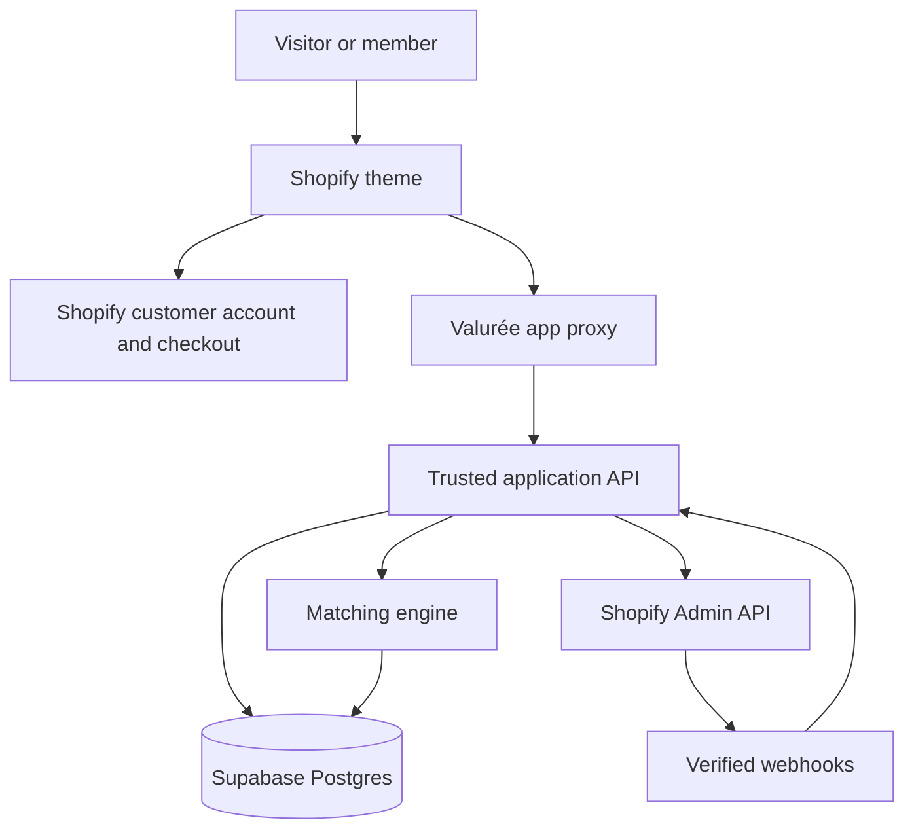

# Phase 0: Current State and Proposed Architecture

Status: planning only. No production integration is implemented by this document.

## Branch safety

- Protected reference: `archive-valuree-v1` at `85531e256498e8c0ddec5d4949dbe63e7ce3d9ab`.
- Phase 0 base: `main` at `2fd3a5e246bf458f3c48f11776e46229362082c4`.
- Development branch: `feature/valuree-membership-platform`.
- No work from this branch may be merged to `main` or published without owner approval.

## Current-state assessment

The current repository is a small Shopify Online Store 2.0 theme prototype with 15 tracked files. It has a valid layout, JSON homepage template, theme settings, global CSS and JavaScript, and reusable hero, generator, process, experience, pricing, CTA, header, and footer sections.

### Reusable

- Brand palette, typography direction, spacing, responsive layout, focus states, and reduced-motion baseline.
- Modular Shopify section approach and homepage JSON template.
- Couple-focused hero and transparent $9.99/month membership presentation.
- Accessible radio-card interaction pattern and API boundary placeholder.
- Member-gate presentation and public marketing structure as design references.

### Replace or harden

- The current membership check reads a storefront-visible customer metafield. This is presentation logic only and is not an entitlement boundary.
- The generator is a four-field prototype. It has no authenticated server, private partner submissions, canonical domain model, resume flow, or tested matching engine.
- The API endpoint setting is an unimplemented placeholder.
- The pricing button has no subscription product or selling-plan destination.
- There are no app routes, Supabase migrations, RLS policies, webhook handlers, idempotency records, rate limits, audit events, or deletion workflows.
- There are no member dashboard, partner invitation, result, history, billing-status, or policy templates.
- There are no locales, snippets, automated tests, Theme Check configuration, linting, formatting, CI, accessibility automation, or secret scanning.
- The stylesheet and JavaScript are still global files and should be separated by responsibility as the application grows.
- The hero fallback uses a store-specific Shopify CDN URL and needs a portable theme-editor asset strategy.
- Google Fonts are loaded through CSS `@import`; production should use performant Shopify-hosted/system assets or preconnect plus non-blocking loading.

## Architecture principles

1. Shopify owns commerce, checkout, customer identity, subscription purchase, billing links, public pages, and theme rendering.
2. A trusted server boundary owns Shopify session validation, webhook verification, entitlement decisions, Supabase privileged calls, and rate limiting.
3. Supabase Auth/Postgres/Storage own application identity mapping and private application data under Row Level Security.
4. The browser receives only the minimum data authorized for the current user and couple context.
5. Private partner submissions are never returned to the other partner. Matching returns a derived explanation, not raw answers.
6. Subscription access is deny-by-default and server enforced. Liquid gating is only a user-experience optimization.
7. Paid-provider-specific work stops until the owner selects the subscription provider.

## Proposed system



## Repository topology recommendation

Keep `valuree-shopify-theme` Shopify-compatible and free of server secrets. Create a separate private application repository for the trusted API, Supabase migrations, Edge Functions or server runtime, webhook handlers, matching engine, and tests. This avoids Shopify theme-sync problems from non-theme files and gives backend code an independent deployment and security lifecycle.

Suggested application repository structure:

```text
apps/web-api/             trusted API and app-proxy handlers
packages/domain/          canonical types and validation
packages/matching/        deterministic recommendation engine
supabase/migrations/      schema, RLS, functions and indexes
supabase/seed/            development-only curated dates
tests/                    unit, integration and authorization tests
docs/                     operations and deployment guides
.env.example              placeholder names only
```

## Trust boundaries

- Public: theme assets, public marketing content, product price display, non-sensitive example dates.
- Authenticated: customer session, own profile, own entitlement summary, couple membership summary.
- Couple-shared: selected recommendations, scheduled/completed dates, explicitly shared notes, bucket-list matches.
- Partner-private: raw check-in answers, private ratings, private notes, unrevealed bucket-list suggestions.
- Server-only: Shopify app secret, service-role key, webhook secrets, raw webhook payload archive, rate-limit controls, idempotency keys.

## Known limitations before Phase 1

- No subscription provider selected or installed.
- No Supabase project or trusted API runtime selected.
- No final decision on Shopify customer accounts versus an application-owned sign-in bridge.
- No legal policy text has been approved.
- Local discovery, weather, venue availability, reminders, and photo uploads remain future integration boundaries.
