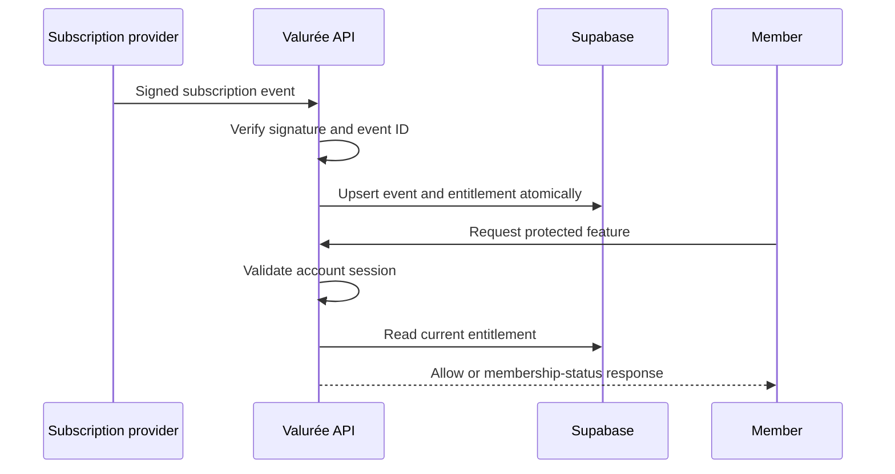
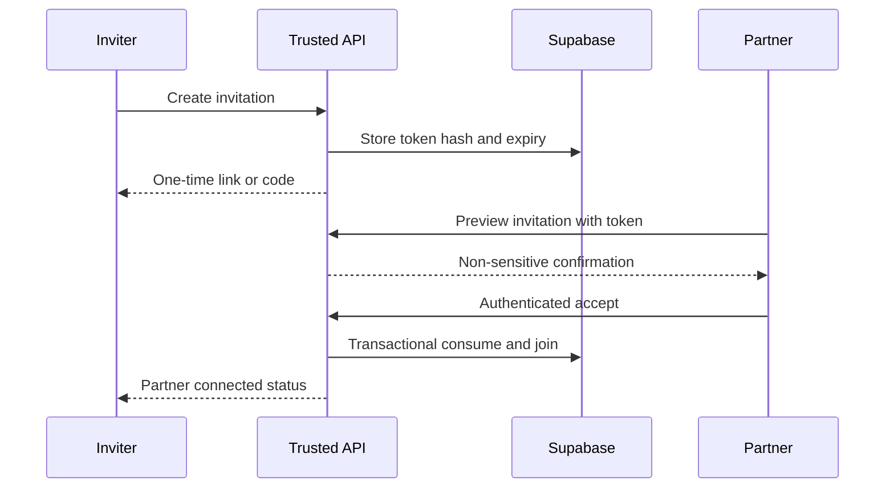

# Security and Subscription Entitlements

## Membership is a server decision

The current Liquid metafield check is not sufficient. Production access requires a trusted API to validate the authenticated user and read a server-maintained entitlement projection created from verified Shopify/provider events.

## Entitlement states

- `active`: protected access allowed.
- `trialing`: allowed only if a provider-backed trial is explicitly approved.
- `past_due`: denied by default; any grace period requires an owner-approved duration and disclosure.
- `paused`, `cancelled`, `expired`, `refunded`, `revoked`, `unknown`: denied.
- Cancellation at period end remains active only until the verified paid-through timestamp.

Every protected request checks entitlement server-side. Cached decisions must expire quickly and be invalidated by webhook updates. A scheduled reconciliation job compares local projections with Shopify/provider state to recover from delayed webhooks.

## Webhooks

- Verify the raw body signature before parsing or processing.
- Reject stale, unsigned, malformed, oversized, or unexpected-topic requests.
- Store a provider event ID or deterministic payload key and process idempotently.
- Acknowledge quickly and process retries safely.
- Never trust customer IDs, status, price, or contract IDs supplied by the browser.
- Log event identifiers and outcomes without unnecessary personal data.

## Authentication bridge

The trusted API must map a validated Shopify customer session to exactly one Supabase profile. The storefront must not mint its own customer identity from a posted email or customer ID. The final mechanism depends on the selected Shopify customer-account and app-proxy strategy.

## RLS policy model

- `profiles`: select/update own row only; privileged identity fields server-only.
- `couple_members`: active members may read membership summary for their own couple.
- `preference_submissions`: author can create/read/update their own draft; the other partner has no select policy; only a security-definer/server matching function may read both.
- `recommendations`, shared dates and shared notes: active couple members only.
- Private ratings, notes and unmatched bucket-list entries: author only.
- Invitations: never listable by token; acceptance occurs through a rate-limited server function using a token hash.
- Entitlements and webhook events: no client writes; minimal entitlement summary may be returned by trusted API.

RLS is defense in depth, not a replacement for server validation. Service-role access is restricted to the trusted runtime and never shipped to the theme.

## Partner invitation flow

Required protections: cryptographic randomness, short expiry, one use, revocation, acceptance confirmation, rate limiting, transactional couple-size checks, and immediate invalidation after acceptance or disconnection.

## Private matching flow

Each partner writes only their own submission. Readiness is derived without returning the other submission. A trusted matching operation reads both, applies hard exclusions first, produces recommendations, stores only safe explanations, and marks the session complete. Raw submissions are never included in shared payloads, logs, URLs, analytics, or notifications.

## Application security controls

- Schema validation and canonicalization at every server endpoint.
- CSRF protection for cookie-authenticated mutations; strict origin checks and SameSite cookies where applicable.
- Per-IP and per-account rate limits for login bridges, invitations, matching, remix, uploads and deletion.
- Content-type, size and file validation for future memories.
- Parameterized database access and least-privilege service functions.
- Security headers, restricted CORS, privacy-conscious analytics and redaction.
- Secret scanning in CI; placeholders only in `.env.example`.
- Re-authentication and confirmation for account deletion, couple disconnection and invitation regeneration.

## Subscription provider boundary

Provider-specific selling-plan creation, contract APIs, customer portal links, webhook topics, cancellation behavior and costs must not be implemented until the owner chooses a provider. Candidate categories:

1. Shopify's first-party subscription solution: likely simplest initial operations and lowest integration complexity; confirm digital-membership support, API/webhook access and current limitations.
2. Established third-party subscription platform: richer dunning, analytics and portals, but adds recurring cost, vendor lock-in and provider-specific data mapping.
3. Custom subscription app: maximum control, but substantially higher security, billing, compliance and maintenance responsibility; not recommended for initial launch.

Recommendation: evaluate Shopify's first-party option first, then choose a third-party provider only if required membership lifecycle or API capabilities are missing. Current pricing and capabilities must be verified at the decision checkpoint.
